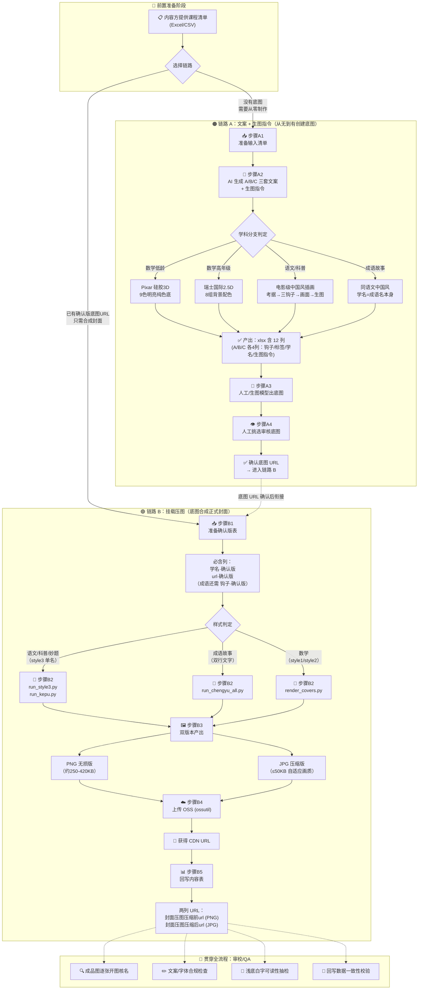
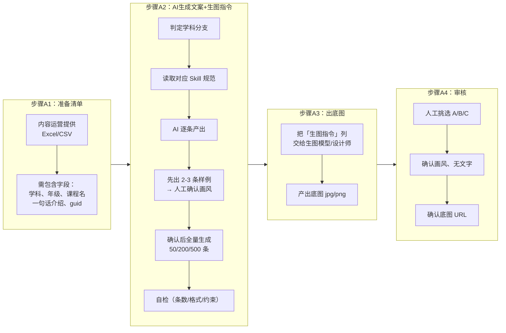
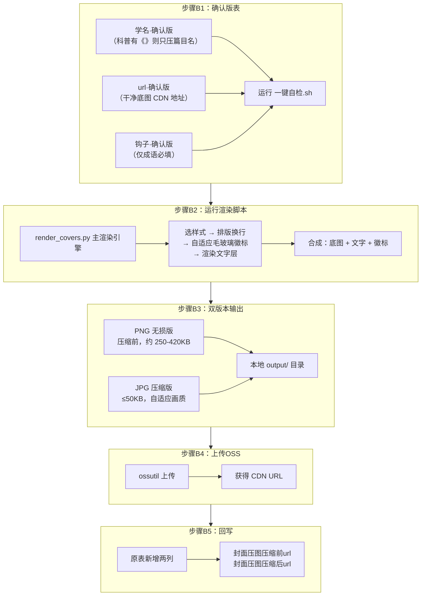

# 千问小讲堂 · 封面制作 — 完整业务流程分析

> **分析日期**：2026-06-04
> **数据来源**：`千问小讲堂-chat挂载封面制作需求/` 目录下全部文档、脚本、数据表
> **目的**：让不熟悉流程的人一篇文章看懂整个封面制作业务

---

## 一、业务背景：我们在做什么

"千问小讲堂"是一个面向 K12 学生的在线教育内容产品。每条课程内容需要一张**竖版封面图（144×192 设计尺寸）**在产品中展示。封面不是简单截图，而是将**底图插画 + 品牌文字（课程名/钩子标语）+ 品牌徽标**合成为统一风格的成品图。

目前已覆盖的内容类型和样式：

| 样式 | 适用学科/内容 | 主文案 | 所用字体 |
|------|-------------|--------|----------|
| **style1** | 小低数学（1-3年级） | 钩子标语（整段自动换行） | 造字工房圆黑 + 阿里巴巴普惠体 |
| **style2** | 小高数学（4-6年级） | 钩子标语（整段自动换行） | 阿里巴巴普惠体 Bold |
| **style3** | 语文课文/古诗词、科普、妙题高招 | 学名（有书名号`《》`则只显示书名号内文字） | HYXinRenWenSong 65W |
| **成语故事** | 成语/寓言 | 成语名（大字号）+ 钩子（小字号） | 65W 标题 + W 常规钩子（白色70%透明度） |

---

## 二、全景流程图

整个封面制作分为两条链路，可以先后串联：

```
链路 A（文案+生图指令）  → 确认底图 URL →  链路 B（挂载压图）
```

### 2.1 总览流程图



### 2.2 链路A详细流程



### 2.3 链路B详细流程



---

## 三、每条链路的详细步骤说明

---

### 🔵 前置准备：判断走哪条链路

**判断标准**：是否已经有确认版的底图 URL？

| 情况 | 走哪条 |
|------|--------|
| 还没有底图，需要从零生成 | **链路 A**（先产文案和生图指令 → 出底图） |
| 已有 `学名·确认版` + `url·确认版` | **链路 B**（直接用底图合成封面） |
| 两条都要做 | **先 A 后 B**（A 出底图 → 确认 URL → B 合成封面） |

---

### 🟠 链路 A：文案 + 生图指令（从无到有创建封面底图）

#### 步骤 A1：准备输入清单

| 负责角色 | 做什么 | 输入 | 产出 |
|----------|--------|------|------|
| **内容运营** | 整理课程清单，提供结构化的内容表 | 课程信息 | Excel/CSV 文件 |

**输入表需包含的字段**：
- `学科` — 数学/语文/成语/科普 等
- `年级` — 用于自动匹配样式（小低1-3 / 小高4-6）
- `课程名` — 课程的正式名称
- `一句话介绍` — 课程核心内容的一句话描述
- `guid` — 每条内容的唯一标识（理想情况下）

**存放位置**：`输入表/` 目录

**工具**：对于新学科，先填写 `文档/templates/新学科需求登记表.md`

---

#### 步骤 A2：AI 生成 A/B/C 三套文案 + 生图指令

| 负责角色 | 做什么 | 输入 | 产出 |
|----------|--------|------|------|
| **内容运营 + AI（Cursor/Claude）** | 按学科规范，AI 为每条课程产出 3 套可选方案 | 课程清单 CSV | xlsx 含 12 列 case |

**什么是 A/B/C 三套方案？**

同一条课程，为运营提供 3 套可选方案，差异主要在钩子文案和画面色调：

| Case | 典型特点 |
|------|----------|
| **A** | 推荐方案 — 悬念反问式钩子 + 主色调 |
| **B** | 第二公式钩子 + 暖调黄昏变体 |
| **C** | 第三公式钩子 + 清透晨光变体 |

**每条课程产出的 12 列**（A/B/C 各 4 列）：

| 字段 | 说明 | 示例 |
|------|------|------|
| **钩子** | 主标题文案，口语化，一般 ≤12 字 | `"这个三角形到底藏着什么秘密？"` |
| **标签** | 分类标签 | 数学：`一年级★超好玩`；语文/成语：`千问小讲堂` |
| **学名** | 课程正式名称 | 数学：课程短名；语文：`[类型]《篇目名》`；成语：成语名本身 |
| **生图指令** | 给生图模型的 Prompt（一整段中文+必要英文锚句） | 含构图、风格、色调、**严禁画面内出现文字** |

**学科分支的差异**（AI 自动按学科匹配规范）：

| 学科 | 画风 | 标签格式 | 特殊规则 |
|------|------|----------|----------|
| **低龄数学 1-3年级** | Pixar 硅胶 3D，明亮纯色底 + 右下角 3D 角色群 | `年级★关键词` | 9色明亮纯色底；禁止画面汉字和过多角色 |
| **高年级数学 4-6年级** | 瑞士国际 2.5D，等距视角 + 左上空右下主体 | `年级｜关键词` | 8组背景+强调色；禁止对角线构图、竖绳 |
| **语文（古诗词/课文/写作/科普）** | 电影级中国风数字插画 | `千问小讲堂` | 必须先**考据**（朝代/服饰/场景）→ 再写画面；红色主题分级 |
| **成语故事** | 同语文中国风，主角多为古代人物/动物 | `千问小讲堂` | 学名 = 成语名本身（无书名号、无前缀） |

**工作节奏**（推荐）：

1. 先让 AI 出 **2-3 条样例**（各学科各一条）
2. 运营/内容**确认画风和钩子风格**
3. 确认后**全量生成**（50/200/500 条）
4. AI **自检**并汇报问题数

---

#### 步骤 A3：出底图（人工/生图模型）

| 负责角色 | 做什么 | 输入 | 产出 |
|----------|--------|------|------|
| **设计师 / 生图模型** | 根据生图指令生成底图插画 | xlsx 中的「生图指令」列 | 底图 jpg/png 文件 |

**关键质量要求**：
- 画面**绝对不能出现汉字**（生图指令必须包含负向锚 `NOTEXT`）
- 主体在画面中下位置（上方留白给后续压文字）
- 风格符合学科规范（Pixar 3D / Swiss 2.5D / 中国风插画）

---

#### 步骤 A4：人工挑选审核底图

| 负责角色 | 做什么 | 输入 | 产出 |
|----------|--------|------|------|
| **内容运营** | 从 A/B/C 三个方案中挑选最佳底图，确认无文字、风格正确 | 生图产出的底图 | 确认后的底图 URL |

**审核要点**：
- 画面是否出现文字（badcase 高发区）
- 风格是否符合学科定位
- 主体位置是否适合后续压文字

**产出物**：确认后的底图 CDN URL，作为链路 B 的输入

> ⚠️ 若还需数学类压钩子/标签文字（非挂载 OSS），此处可用 `compose_math.py` 做数学底图压字（仍在链路 A 范畴）。

---

### 🟢 链路 B：挂载压图（底图 → 正式封面 → OSS → 回写）

#### 步骤 B1：准备确认版表

| 负责角色 | 做什么 | 输入 | 产出 |
|----------|--------|------|------|
| **内容运营** | 整理已确认底图 URL 的内容表 | 确认后的底图信息 | 符合规范的 CSV/xlsx |

**表头约定**（列名中间点有无均可，脚本已兼容）：

| 列名 | 是否必填 | 说明 |
|------|----------|------|
| `学名·确认版` 或 `学名确认版` | ✅ 必填 | 科普/妙题类注意：有`《》`时压图只显示书名号内文字 |
| `url·确认版` 或 `url确认版` | ✅ 必填 | 干净底图的 CDN 地址 |
| `钩子·确认版` | 仅成语必填 | 科普/妙题/style3 **不需要钩子** |
| `封面压图压缩前url` | 脚本回写 | PNG 无损版 CDN 地址 |
| `封面压图压缩后url` | 脚本回写 | JPG 压缩版 CDN 地址 |

**环境检查**：运行 `一键自检.sh` 检查 Python、字体、依赖是否就绪

```bash
cd 脚本
pip3 install -r requirements.txt --user
```

---

#### 步骤 B2：运行渲染脚本

| 负责角色 | 做什么 | 输入 | 产出 |
|----------|--------|------|------|
| **工程 / 运营（通过 Cursor）** | 按内容类型选择对应脚本，运行渲染 | 确认版表 CSV | 本地封面图片（PNG + JPG） |

**样式与脚本对应关系**：

| 内容类型 | 样式 | 主文案 | 钩子 | 脚本 | 已跑通量 |
|----------|------|--------|------|------|----------|
| 语文课文/古诗词 | style3 | 学名（仅篇目名） | ❌ 无 | `run_style3.py` | 479 条 |
| 科普、妙题高招 | style3 | **仅`《》`内文字** | ❌ 无 | `run_kepu.py` | 105 条 |
| 成语故事 | 成语双行 | 成语名 + 钩子 | ✅ 需要 | `run_chengyu_all.py` | 50 条 |
| 小低/小高数学 | style1/2 | 钩子 + 标签 | ✅ 需要 | `render_covers.py` | 待产品化 |

**标准命令示例**：

```bash
# 科普 + 妙题高招（无钩子，书名号内学名）
python3 run_kepu.py \
  --csv "../输入表/科普+妙题高招线上内容汇总.csv" \
  --out-dir output/kepu

# 语文全量（仅学名）
python3 run_style3.py \
  --csv "../输入表/语文类内容汇总.csv" \
  --out-dir output/style3

# 成语 50 篇（学名 + 钩子，20张设计成品 + 30张自动生成）
python3 run_chengyu_all.py \
  --csv "../输入表/成语表.csv" \
  --out-dir output/chengyu
```

**脚本内部处理逻辑**（`render_covers.py` 主引擎）：
1. **选样式** — 按学科/年级自动匹配 style1/2/3/成语
2. **排版换行** — 智能断行（按标点断、避免孤字、两行均衡）
3. **自适应毛玻璃徽标** — 徽标颜色自动匹配底图主色（非固定绿色）
4. **文字渲染** — 指定字体/字号/字重/位置渲染文字层
5. **合成输出** — 底图 + 文字层 + 徽标层合成最终封面

---

#### 步骤 B3：双版本产出

| 负责角色 | 做什么 | 输入 | 产出 |
|----------|--------|------|------|
| **脚本自动** | 每条内容输出两个版本 | 渲染合成结果 | PNG + JPG 文件 |

| 版本 | 格式 | 大小 | 用途 |
|------|------|------|------|
| **压缩前** | PNG 无损 | 约 250–420KB | 存档/高清使用 |
| **压缩后** | JPG 有损 | ≤50KB（自适应画质） | 线上加载 |

- 本地存放在 `output/<学科>/covers/<md5>.png` + `.jpg`
- 同时生成 `manifest.csv`：学名、压图标题、原图 url、PNG/JPG CDN

---

#### 步骤 B4：上传 OSS

| 负责角色 | 做什么 | 输入 | 产出 |
|----------|--------|------|------|
| **脚本自动 / 工程** | 使用 ossutil 上传到阿里云 OSS | 本地 PNG + JPG | CDN URL |

- 工具：`~/Desktop/ossutilmac64`（需本机配置，涉账号凭证）
- 上传后获得 CDN 加速访问 URL

---

#### 步骤 B5：回写内容表

| 负责角色 | 做什么 | 输入 | 产出 |
|----------|--------|------|------|
| **脚本自动** | 将 CDN URL 回填到原表 | CDN URL | 带 URL 的回填 CSV |

在原表基础上新增两列：
- `封面压图压缩前url` — PNG 无损版 CDN 地址
- `封面压图压缩后url` — JPG 压缩版 CDN 地址

---

### 🔴 贯穿全流程：审校/QA

| 步骤 | 负责角色 | 做什么 |
|------|----------|--------|
| **核名** | 审校 | 逐张打开成品图，核对文件名与实际内容是否一致 |
| **文案合规** | 审校 | 检查文字内容是否准确、字体是否正确 |
| **可读性** | 审校 | 浅底白字场景是否可读（压暗/毛玻璃/阴影处理是否到位） |
| **数据一致性** | 审校 | 回写 URL 与内容是否一一对应 |

---

## 四、涉及的角色与分工总览

| 角色 | 核心职责 | 出现在哪些步骤 |
|------|----------|----------------|
| **产品经理** | 制定输入规范、唯一 ID 标准、交付标准、覆盖范围 | A1, B1 |
| **内容/运营** | 提供课程清单、确认文案/钩子风格、挑选底图 | A1, A2, A4, B1 |
| **设计师** | 固化 Figma 设计规格、出底图、成品图命名 | A3, B(规格) |
| **工程** | 维护渲染/压缩/上传/回写脚本、环境配置 | A2(脚本), B2-B5 |
| **审校/QA** | 成品图核名、文案字体合规、可读性抽检、回写校验 | 全流程末端 |

---

## 五、当前进展与已完成批次

| 批次 | 条数 | 样式 | 脚本 | 状态 |
|------|------|------|------|------|
| 语文挂载 | 479 条 | style3 单名 | `run_style3.py` | ✅ 已全量完成 |
| 成语故事 | 50 条 | 成语双行 | `run_chengyu_all.py` | ✅ 已全量（20设计+30自动生成） |
| 科普+妙题高招 | 105 条 | style3 无钩子 | `run_kepu.py` | ✅ 已全量完成 |
| 语文问题重修 | 按问题表 | style3 | `run_yuwen_fix.py` | ✅ 已完成 |
| 数学挂载 | - | style1/2 | `render_covers.py` | 🔲 待产品化 |

---

## 六、已知卡点与注意事项

| # | 问题 | 严重程度 | 建议解决方案 |
|---|------|----------|--------------|
| 1 | **成品图错名** — 文件名与图片内容不对应 | 🔴 高 | 设计出图后逐张核名；改用 guid 关联 |
| 2 | **设计规格未沉淀** — 字体/字号/位置靠人工量取 | 🔴 高 | 设计在 Figma 固化为可读规格文档 |
| 3 | **浅底白字可读性差** — 无统一处理标准 | 🟡 中 | 制定压暗/毛玻璃/阴影的判定规则 |
| 4 | **钩子换行孤字** — 如句尾单字独占一行 | 🟡 中 | 内容侧约定断行规则（按标点断、避免孤字） |
| 5 | **列名不统一** — `学名·确认版` vs `学名确认版` | 🟡 中 | 产品统一命名规范（脚本已兼容变体） |
| 6 | **匹配靠中文名** — 非 guid 关联 | 🟡 中 | 增加 guid 做唯一关联 |
| 7 | **OSS 凭证硬编码** — 不可协作、有安全隐患 | 🟡 中 | 凭证外置、环境变量化 |
| 8 | **审校环节缺失** — 无系统性检查 | 🔴 高 | 增设审校/QA 角色，建立检查清单 |

---

## 七、关键文件路径速查

| 用途 | 路径 |
|------|------|
| 启动包根目录 | `千问小讲堂-文本挂载封面生产包/` |
| 从此开始 | `00-从这里开始.md` |
| 完整需求说明 | `封面生成工作流与需求说明.md` |
| 链路 B 说明 | `挂载压图分支说明.md` |
| 学科分支说明 | `文档/学科分支说明.md` |
| 工作流总览 | `文档/工作流总览.md` |
| 项目演进日志 | `文档/logs/项目演进记录.md` |
| AI Skill 定义 | `SKILL.md` |
| 渲染主脚本 | `脚本/render_covers.py` |
| 科普脚本 | `脚本/run_kepu.py` |
| 语文脚本 | `脚本/run_style3.py` |
| 成语脚本 | `脚本/run_chengyu_all.py` |
| 字体资源 | `脚本/assets/*.ttf` |
| 数据归档 | `../千问小讲堂-封面数据归档/` |
| 输入表存放 | `输入表/` |
| 产出示例 | `产出示例/` |
| 发给同事 | `如何发给同事.md` |
| Cursor 开场话术 | `发给Cursor的开场话术.md` |

---

## 八、对新人的一句话总结

> **封面制作 = 两条链路**：**链路 A** 用 AI 为课程写好钩子+生图指令 → 设计师/模型出底图 → 人工审核；**链路 B** 把确认好的底图+课程名用脚本合成统一风格封面 → 双版本输出 → 上传 OSS → 回写 CDN URL。两条链路中间由「确认底图 URL」这个动作衔接。整个流程需要内容、设计、工程、审校四方协作，目前最大的痛点是成品图错名和审校环节缺失。
