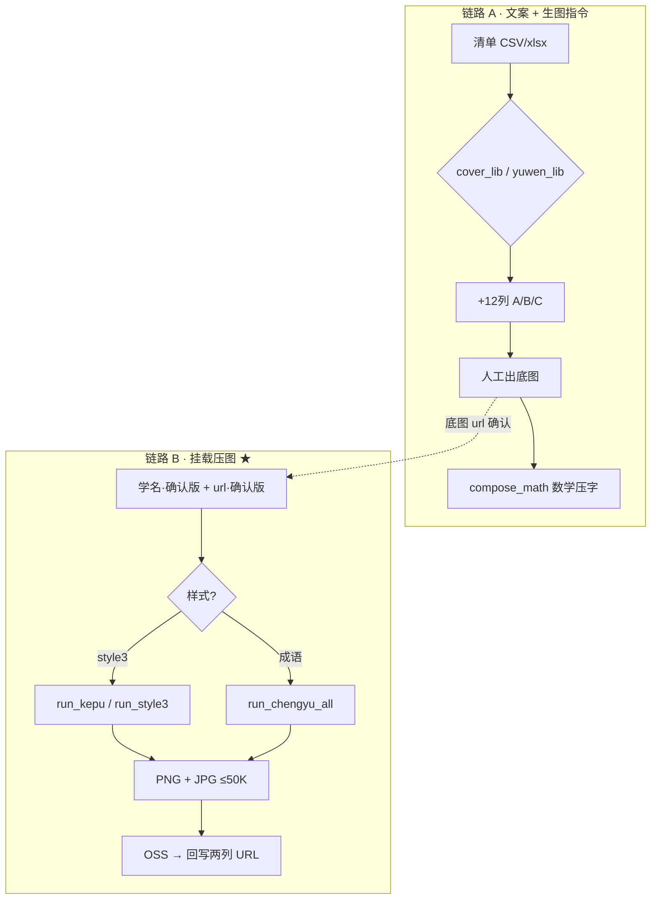

# 工作流总览

## 全景（双链路）

链路 B 说明见 **`挂载压图分支说明.md`**；代码在 `~/Desktop/qianwen-cover-generator/`。

## 角色分工

| 角色 | 输入 | 输出 |
|------|------|------|
| **你（内容）** | 课程表、一句话介绍、画风确认 | 确认样例、选 A/B/C |
| **Cursor Agent** | 本启动包 + 源表 | xlsx（12 case 列）、自检报告 |
| **生图** | 生图指令列 | 底图 url/文件 |
| **设计/技术（可选）** | 底图 + 文案表 | 压字 png（`render_covers` 规范） |

## 阶段说明

### 阶段 1：文案与指令（可完全自动化）

- **数学**：从「学科、年级、课程名、介绍」推导钩子/标签/卡片名/配色/生图指令；3 case 轮转配色与钩子公式。
- **语文**：必须先「考据」（朝代、服饰、场景）再写 hero；3 case 轮转标题 + 时辰色调。
- **成语**：同语文画风；钩子三式；学名用成语名。

### 阶段 2：生图（人工或外部模型）

- 把 xlsx 里「A/B/C 生图指令」导出给生图流程。
- 常见 badcase：**画面出现汉字** → 检查 prompt 是否含「文字/标题区」正向描述；必须用 `NOTEXT_HEAD` 负向锚（见语文/数学 v2 规范）。

### 阶段 3：压图合成（数学已打通）

1. **底图标准化**（主体下移、居中，边缘像素延展补边，避免色带）
2. **文字**：小低 Figma 规则（优先 1 行）；徽标色 = 底图主色加深
3. **批量**：按年级命名输出 + 质检清单（主体是否过高需重出）

语文/成语/科普**挂载压图**已在链路 B 打通（`render_covers.py` style3 / 成语布局），与 `compose_math` 分离。

## 3-case 是什么意思？

同一条课，给运营 **3 套可选方案**：

| Case | 典型差异 |
|------|----------|
| **A** | 推荐方案（常对应悬念反问式钩子 + 主色调） |
| **B** | 第二公式钩子 + 暖调黄昏变体 |
| **C** | 第三公式钩子 + 清透晨光变体 |

数学 case 差异主要在：钩子文案、配色 accent、部分生图元素。  
语文/成语 case 差异主要在：钩子文案、color_tone/light/mood 变体。

## 验收标准（给你拍板用）

1. 钩子：像「对孩子说话」，不剧透、不说教、不堆成语四字当标题  
2. 生图：主体在下、上方能压白字、**无文字**、风格符合学科  
3. 压图：字不压主体、无右侧/底部色带、徽标不是死绿（随底图变）  
4. xlsx：条数齐、列名对、能直接给生图同事用  
